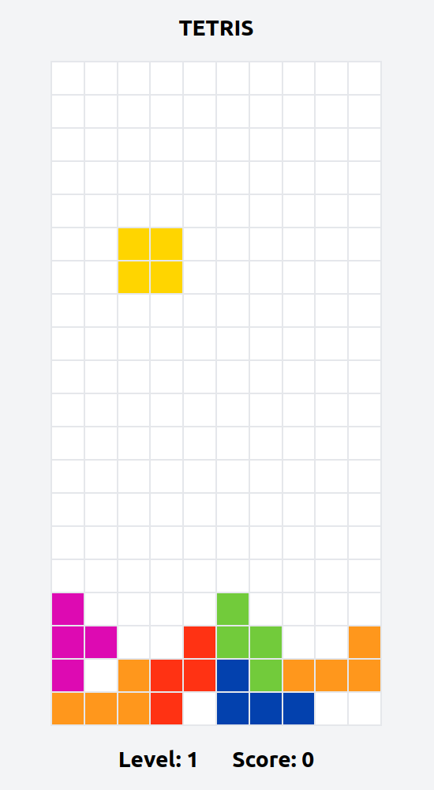

# tetris-reagent

[](https://github.com/codeasone/tetris-reagent/actions/workflows/build.yml)

Tetris implemented using [reagent](https://github.com/reagent-project/reagent) with game-logic from [tetris-clj](https://github.com/codeasone/tetris-clj).



## Play

You can play at: https://tetris-reagent.onrender.com (if it's a cold start it may take 20 seconds to start-up)

Controls:

- `ENTER` to start/resume play
- ⬅️ ⬇️ ➡️ to move current tetrimino
- ⬆️ to rotate current tetrimino
- `SPACE` to drop
- `ESC` to pause

Once you encounter a `Game Over` you can start again by reloading.

## Packaging

The release assets and nginx image only take up 16.33 MB.

To build and run the Docker image locally:

```
docker build . -t tetris-reagent
docker run -p 8080:80 tetris-reagent:latest
```

Then visit http://localhost:8080

Every commit to `main` triggers a `build.yml` workflow that builds and pushes a `latest` image to [DockerHub](https://hub.docker.com/repository/docker/codeasone/tetris-reagent/general)

__Tip:__ the [act](https://github.com/nektos/act) tool works great for evaluating and debugging GitHub flows locally:

```
act -s DOCKERHUB_USERNAME=<username> -s DOCKERHUB_TOKEN=<secret>
```

## Development

If you're using [asdf](https://github.com/asdf-vm/asdf) then you'll want to `asdf install`.

If not just make sure you have compatible `java`, `clojure`, and `nodejs` versions installed on your system.

Next, install the project dependencies with `yarn install`.

Then ensure the styles are available by invoking `yarn run styles:dev`.

This project uses `shadow-cljs` and the build to bring up is `:app`.

If you usually start `shadow-cljs` in a separate terminal from your IDE then running `yarn run dev` will watch for code changes and recompile/hot-reload as required.

For Emacs users `.dir-locals.el` is included with settings that will help ensure a `shadow-cljs` nREPL is started automatically via `shadow.cljs.devtools.server.nrepl` when invoking `cider-jack-in-cljs`.

Once up you can interact with the game at http://localhost:3000/ and the `tap>` inspector is available as usual at http://localhost:9630/inspect.
